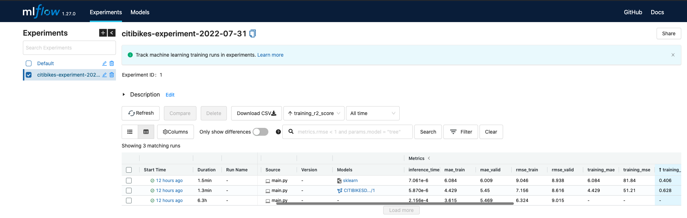
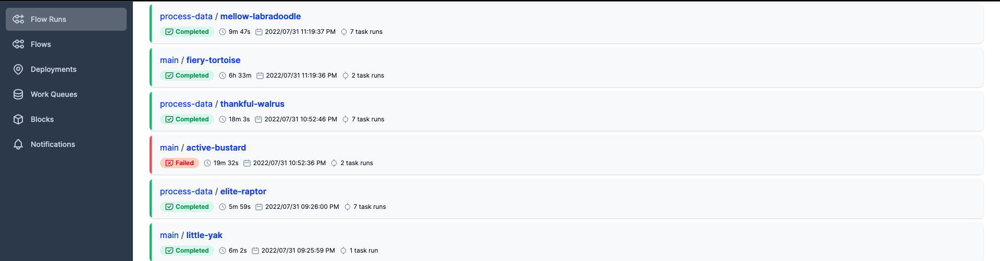
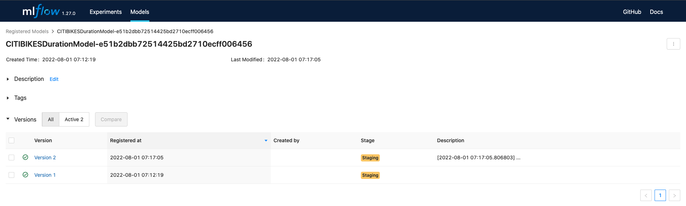
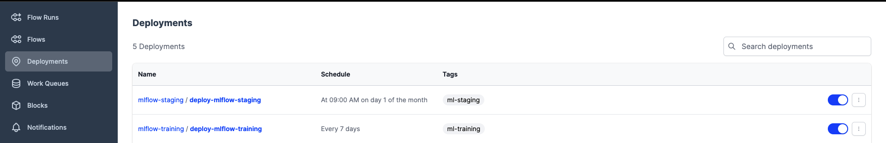
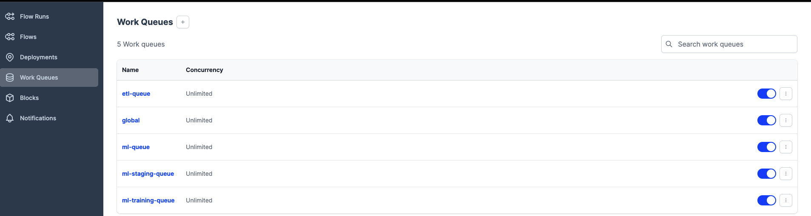
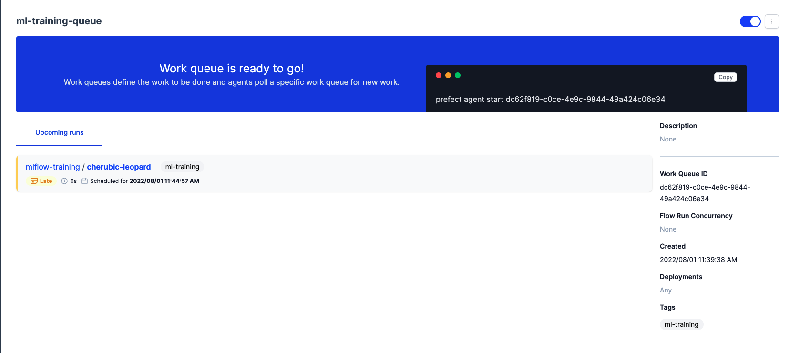
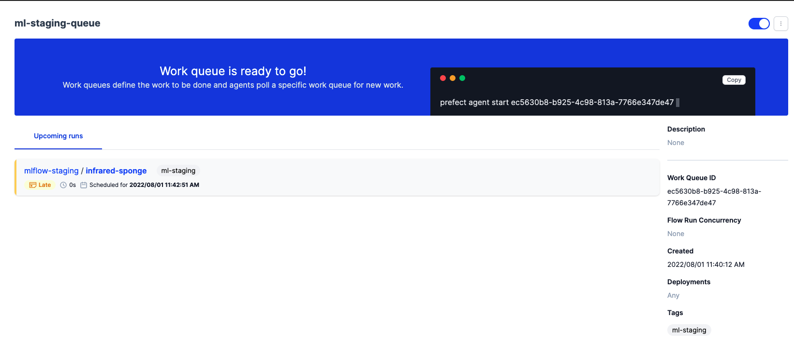
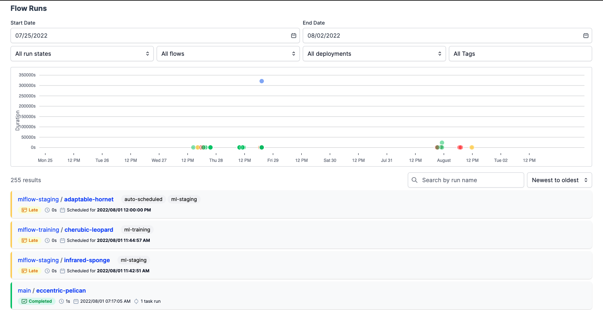

# MLOPS PROJECT

## Project Setup

Clone the project from the repository

```
git clone https://github.com/PatrickCmd/mlops-project.git
```

Change to mlops-project directory

```
cd mlops-project
```

Setup and install project dependencies

```
make setup
```

Add your current directory to python path

```
export PYTHONPATH="${PYTHONPATH}:${PWD}"
```

### Start Local Prefect Server

In a new terminal window or tab run the command below to start prefect orion server


```
prefect orion start
```

### Start Local Mlflow Server

The mlflow points to S3 bucket for storing model artifacts and uses sqlite database as the backend end store

Create an S3 bucket and export the bucket name as an environment variable as shown below

In a new terminal window or tab run the following commands below

```
export S3_BUCKET_NAME=bucket_name
```

Start the mlflow server

```
mlflow server --backend-store-uri sqlite:///mlflow.db --default-artifact-root s3://${S3_BUCKET_NAME} --artifacts-destination s3://${S3_BUCKET_NAME}
```

### Running model training and model registery staging pipelines locally

#### Model training

```
python main.py --train_file 202204-capitalbikeshare-tripdata.zip --valid_file 202205-capitalbikeshare-tripdata.zip
```





### Register and Stage model 

```
python stage.py --tracking_uri http://127.0.0.1:5000 --experiment_name valid_experiment_name
```




### Create scheduled deployments and agent workers to start the deployments

```
prefect deployment create deployments.py
````



Create work queues

```
prefect work-queue create -t "ml-training" ml-training-queue
prefect work-queue create -t "ml-staging" ml-staging-queue
```







Run deployments locally to schedule pipeline flows

```
prefect deployment run mlflow-training/deploy-mlflow-training
prefect deployment run mlflow-staging/deploy-mlflow-staging
```




## Deploy model as a web service locally

Change to `webservice` directory an follow the instructions [here](https://github.com/PatrickCmd/mlops-project/blob/main/web_service/README.md)
